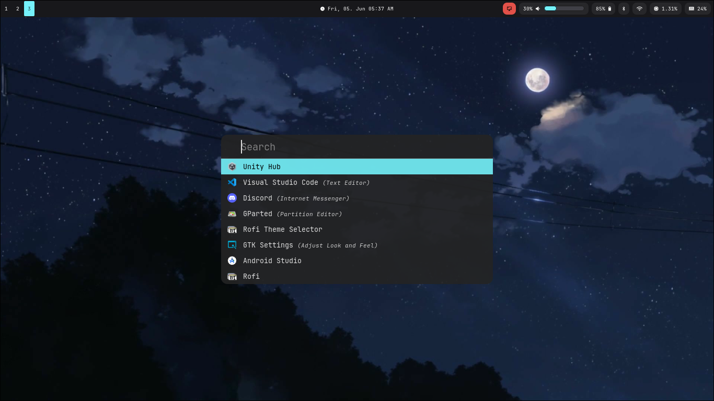
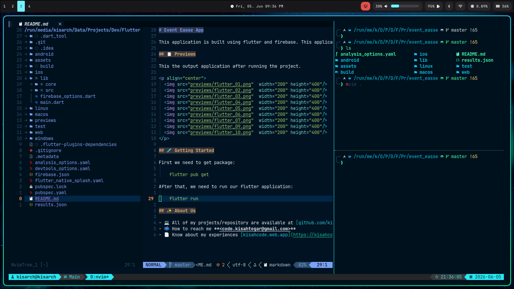
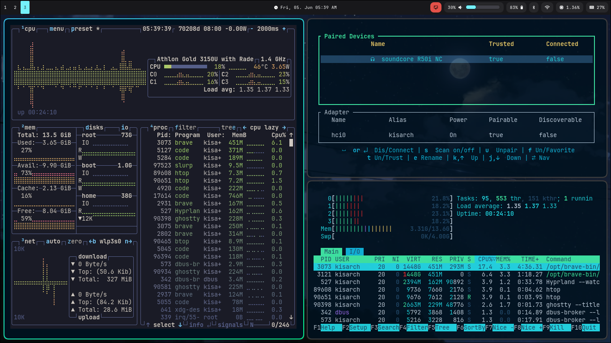

# Dotfiles

Personal Linux development environment setup using:

* Hyprland
* Waybar
* Neovim
* tmux
* Zsh
* Ghostty
* Rofi
* wpaperd

Managed using GNU Stow.

---

## Preview

### Desktop



### Terminal + Neovim



### Monitoring Tools



---

## Features

* Wayland-based desktop environment
* Modular dotfiles structure
* GNU Stow managed configuration
* Neovim development workflow
* tmux session persistence
* Dynamic Waybar modules
* Rofi launcher integration
* Wallpaper rotation with wpaperd
* Shared terminal color ecosystem

---

## Structure

```text
dotfiles/
├── ghostty/
├── hypr/
├── nvim/
├── rofi/
├── tmux/
├── waybar/
├── wezterm/
├── wpaperd/
└── zsh/
```

---

## Modules

| Module                         | Description                               |
| ------------------------------ | ----------------------------------------- |
| [ghostty](./ghostty/README.md) | GPU-accelerated terminal emulator         |
| [hypr](./hypr/README.md)       | Hyprland Wayland compositor configuration |
| [nvim](./nvim/README.md)       | Lua-based Neovim setup                    |
| [rofi](./rofi/README.md)       | Application launcher                      |
| [tmux](./tmux/README.md)       | Terminal multiplexer                      |
| [waybar](./waybar/README.md)   | Wayland status bar                        |
| [wezterm](./wezterm/README.md) | Alternative terminal emulator             |
| [wpaperd](./wpaperd/README.md) | Wallpaper daemon                          |
| [zsh](./zsh/README.md)         | Shell configuration                       |

---

## Requirements

### Core Packages

```bash
sudo pacman -S \
    hyprland \
    waybar \
    rofi-wayland \
    ghostty \
    wezterm \
    neovim \
    tmux \
    zsh \
    wpaperd
```

---

## Fonts

Required Nerd Fonts:

* JetBrainsMono Nerd Font
* MesloLGS Nerd Font

---

## GNU Stow Setup

Clone repository:

```bash
git clone https://github.com/yourusername/dotfiles.git ~/dotfiles
cd ~/dotfiles
```

---

### Stow Configurations

```bash
stow zsh
stow hypr
stow waybar
stow rofi
stow ghostty
stow wezterm
stow tmux
stow nvim
stow wpaperd
```

---

## Notes

### Wayland

This setup is designed primarily for:

* Hyprland
* Wayland workflow
* keyboard-driven navigation

---

## Related Tools

* Hyprland
* Waybar
* Rofi
* Neovim
* tmux
* lazy.nvim
* Powerlevel10k
